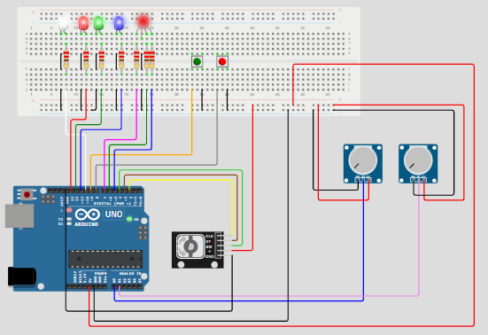
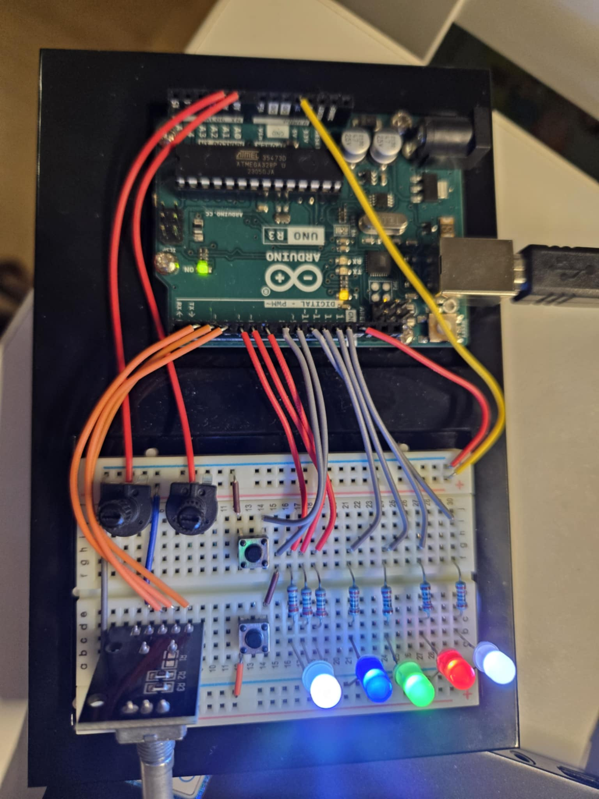

# ***Electrical and basic programming for embedded systems  IoT25***

Welcome to my individual assignment for Electrical and basic programming for embedded systems (IoT25)!

## Background

This project is an assignment for the course **Electrical and basic programming for embedded systems** under my education **Software development, embedded systems and IoT** in Yrkehögskolan Nackademin Solna, Sweden. This project controls LEDs on an Arduino using buttons, potentiometers, and a rotary encoder with AVR C and non-blocking timing.

## Project Descriptions

This project is an embedded systems assignment where an Arduino-based circuit controls LEDs using buttons, potentiometers, and a rotary encoder.
The program is written in pure C using register manipulation, without relying on Arduino helper functions for logic control. Timing and event handling are implemented using non-blocking techniques (e.g., millis()-based timing) rather than busy-wait loops.

The system demonstrates interaction between multiple hardware components and different control inputs while maintaining responsive, non-blocking behavior.

## Hardwares
- Arduino Microcontroller
- 4 x Leds (red, green, blue, white)
- 1 x RGB
- 1 x rotary encoder
- 2 x push buttons
- 2 x potentiometers
- 7 x 220 Ohm resistors

## Features

1. Mode 1: Default
    - Leds: all blink very 250ms
    - RGB: off
    - Potentiometer 1 adds on time interval when LEDs blink in general
2. Mode 2: select color from RGB and control relevant Led
    - twist rotary encoder -> change RGB color (off/red/green/blue/white)
    - press rotary switch -> confirm selected color from RGB (e.g. RGB-red) and disable rotary encoder changing RGB color
    - If selected RGB color = off, LEDs blink in sequence
    - Potentiometer 2 adds on time interval when LEDs blink in sequence
    - press push button 1 -> control the relevant LED (e.g. red) on/off
    - press push button 2 -> reset the relevant LED (e.g. red) to blinking state
3. Mode 3: control from UART terminal
    - "disable X": keep LED color X OFF
    - "enable X": restore LED color X default state (blinking)
    - "toggle X": toggle LED color X (ON)
    - *** X: red/green/blue/white





## Project Structure
```
project
    +---build               # all .d .o .hex 
    +---include             # all .h
    +---src                 # all .c 
    ├───makefile
    ├───diagram.json
    \───wokwi.toml              
```

## Requirement
1. avr-gcc (AVR compiler) https://github.com/ZakKemble/avr-gcc-build/releases/

2. Makefile

```bash
pacman -S --needed base-devel mingw-w64-x86_64-toolchain
```

3. Wokwi Extension

## Installation
```bash
# Clone the repository
git clone https://github.com/VenusauRRR/Blink-hell-Ellara.git

# Change directory
cd repo

# compile the project
make

# download the project to arduino
make flash

```